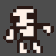

A simple demo implementation of destructable enemy bodies (aka 'gibs').

I wanted to see if the naive, brute-force approach of just spawning sprites would work. And it does! I can destroy hundreds and hundreds of skeletons on my lower-end PC without Godot breaking a sweat.

# Controls
- WASD / Arrow keys: Move
- Left Mouse: Hold to charge shot, release to fire
- Home: spawn skeleton
- Esc: Restart

# License
MIT (Expat)

